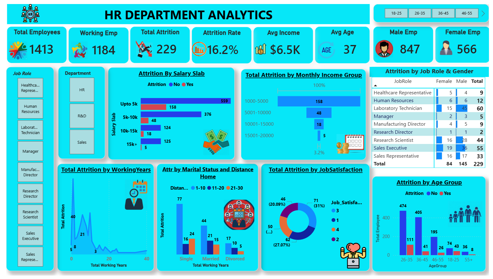
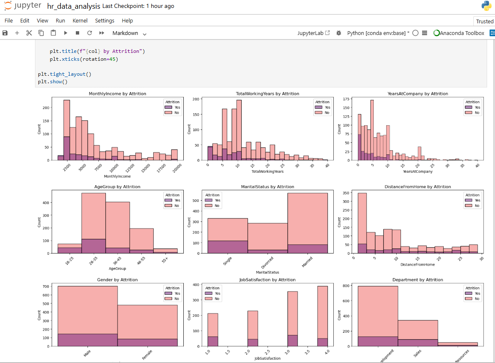

<h1 align="center">📊 HR Analytics Dashboard</h1>

  

<h2>📌 Project Overview</h2>

This project focuses on analyzing HR employee data to uncover workforce trends,
employee attrition patterns, salary insights, and job satisfaction metrics.
The objective of this project is to help organizations make better HR decisions
through data-driven insights.

The complete analysis and dashboard development were performed using
<b>Power BI, Python, SQL, and Excel</b>.

<h2>🚀 Tools & Technologies Used</h2>

<ul>
  <li>🐍 Python</li>
  <li>🗄️ SQL (Using Python)</li>
  <li>📊 Power BI</li>
  <li>📑 Excel</li>
  <li>📚 Pandas, Matplotlib & Seaborn</li>
</ul>

<h2>🔍 Project Workflow</h2>

<h3>1️⃣ Data Collection</h3>
<ul>
  <li>Imported HR employee dataset from Excel</li>
  <li>Loaded dataset into Python for analysis</li>
</ul>

<h3>2️⃣ Data Cleaning & Preprocessing</h3>
<ul>
  <li>Handled missing values</li>
  <li>Fixed inconsistent categorical values</li>
  <li>Created new columns and salary groups</li>
  <li>Performed feature engineering using Python</li>
</ul>

<h3>3️⃣ SQL Analysis</h3>
<ul>
  <li>Used SQL queries inside Python for KPI generation</li>
  <li>Performed aggregation and filtering</li>
  <li>Created SQL Views for insights</li>
</ul>

<h3>4️⃣ Exploratory Data Analysis (EDA)</h3>
<ul>
  <li>Employee Attrition Analysis</li>
  <li>Salary Slab Analysis</li>
  <li>Age Group Analysis</li>
  <li>Department-wise Attrition</li>
  <li>Gender Distribution</li>
  <li>Job Satisfaction Insights</li>
  <li>Working Years Analysis</li>
</ul>

<h3>5️⃣ Power BI Dashboard</h3>
<ul>
  <li>Interactive KPI Cards</li>
  <li>Filters & Slicers</li>
  <li>Bar Charts & Donut Charts</li>
  <li>Employee Detail Table</li>
  <li>Attrition Trend Visualizations</li>
</ul>

<h2>📈 Key Insights</h2>

<ul>
  <li>📌 Overall Attrition Rate: <b>16.2%</b></li>
  <li>📌 Employees aged <b>26–35</b> show the highest attrition</li>
  <li>📌 Lower salary groups have higher employee turnover</li>
  <li>📌 Lower job satisfaction increases attrition chances</li>
  <li>📌 Frequent business travel impacts employee retention</li>
</ul>

<h2>📊 Dashboard Features</h2>

✔ Employee Demographics Analysis  
✔ Attrition Analysis  
✔ Salary Insights  
✔ Gender-wise Analysis  
✔ Department-wise Insights  
✔ Job Satisfaction Tracking  
✔ Working Years Analysis  
✔ Interactive Visualizations

<h2>🧠 Skills Gained</h2>

<ul>
  <li>Data Cleaning</li>
  <li>Data Visualization</li>
  <li>Exploratory Data Analysis</li>
  <li>SQL Query Writing</li>
  <li>Dashboard Development</li>
  <li>Business Insight Generation</li>
</ul>

<h2>📷 Dashboard Preview</h2>

  

<h2>📌 Conclusion</h2>

This project helped me strengthen my practical skills in
<b>Data Analytics, Business Intelligence, SQL, Python, and Power BI</b>
by working on real-world HR employee data and building interactive dashboards
for decision-making support.

<h3 align="center">⭐ If you like this project, feel free to star the repository!</h3>
